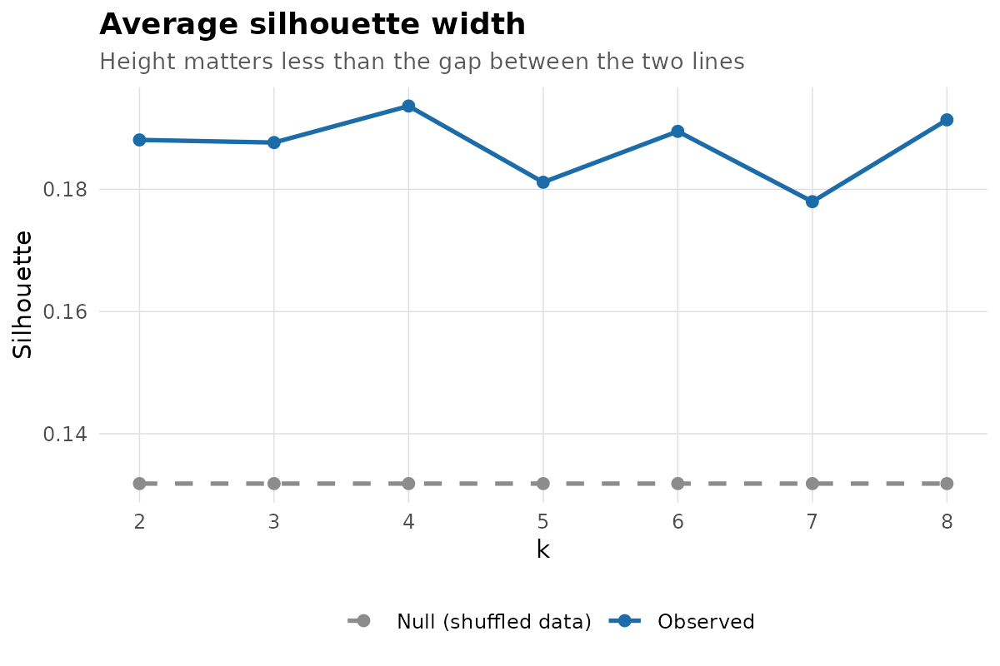
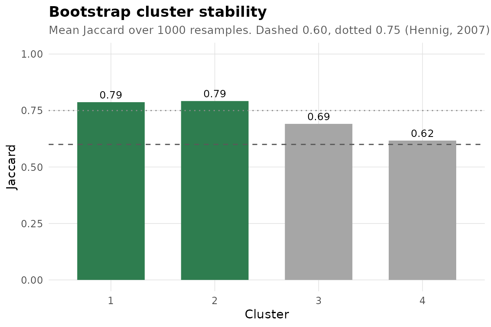
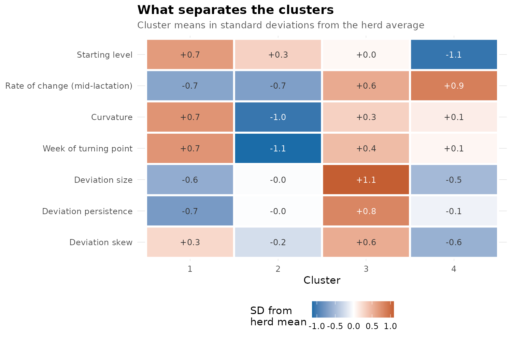
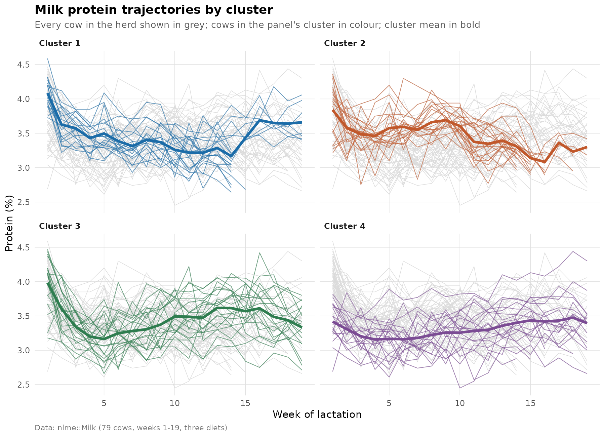
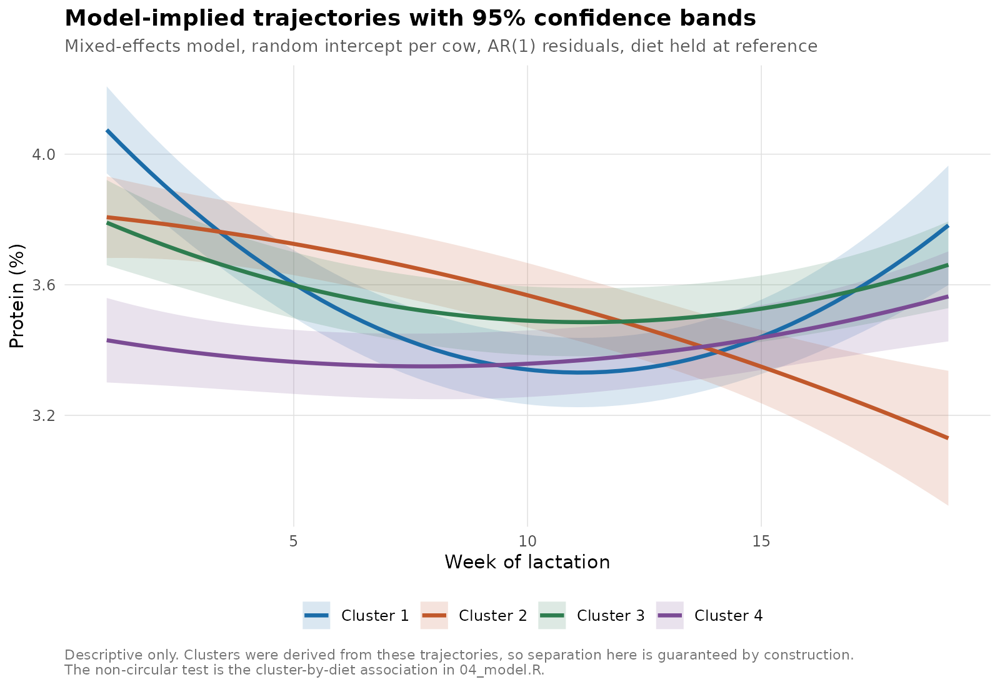

# Clustering lactation trajectories and testing whether the clusters are real

Cows do not respond uniformly across lactation. Averaging across a herd hides
the variation that matters. This repository identifies distinct trajectory
types from repeated measurements on individual cows, **tests whether those
types are anything more than an algorithm partitioning a cloud**, and then
asks whether they connect to anything outside the data they were built from.

Fully reproducible from a public dataset. Runs in about a minute.

---

## The three questions

1. Do individual cows follow distinguishable trajectory patterns, or is the
   variation continuous?
2. If an algorithm returns groups, are they structure in the data or an
   artefact of asking for groups?
3. Does group membership connect to anything that was not used to build it?

Most clustering analyses answer only the first. Questions 2 and 3 are where
this one spends its effort, and they are the reason the headline result below
is more interesting than a clean four-cluster story would have been.

---

## Data

`nlme::Milk` — protein content of milk samples from 79 cows, measured weekly
from week 1 to week 19 of lactation, across three diet treatments. Ships with
the `nlme` package, so this runs with no data request and nothing restricted
in the repository.

1337 observations, unbalanced: 12 to 19 weekly records per cow.

---

## Method

**Feature extraction.** Each cow's series is reduced to seven shape and
stability descriptors rather than clustered on raw values, because clustering
raw series mostly recovers overall level. Four describe the curve — starting
level, rate of change at mid-lactation, curvature, week of the turning point.
Three describe deviations from the cow's own fitted curve — their size,
persistence and skew — following Poppe et al. (2020), who use exactly these
as resilience indicators.

**Clustering.** k-means, Hartigan-Wong (Hartigan & Wong, 1979), 100 random
restarts, on standardised features. k chosen by average silhouette width
(Rousseeuw, 1987) across k = 2 to 8.

**Null benchmark.** k-means optimises silhouette, so it returns a positive
silhouette on pure noise. 200 datasets are generated by shuffling each feature
independently across cows — preserving every marginal distribution, destroying
all joint structure — and reclustered, giving a reference distribution for
what "no structure" scores.

**Stability.** Bootstrap resampling with Jaccard similarity (Hennig, 2007),
1000 resamples.

**Modelling.** Linear mixed-effects model, random intercept per cow, AR(1)
residual correlation, fitted with `nlme::lme`.

**Cross-checks.** The clustering is independently reimplemented in
scikit-learn and the model in statsmodels.

---

## Results

### There is structure, but it is weak and continuous

k = 4 gives the best average silhouette, at **0.194**. Taken against
Rousseeuw's rules of thumb, anything below 0.25 means no substantial
structure, and the naive reading is that there is nothing here.

The null benchmark says otherwise:

| | Average silhouette |
|---|---|
| Observed, k = 4 | **0.194** |
| Shuffled data, median | 0.132 |
| Shuffled data, 95th percentile | 0.145 |
| Empirical p | **0.005** |

The separation is well outside what structureless data of the same shape
produces. Both statements are true at once, and the honest summary is that
**the trajectory types are real and reproducible, but they are regions of a
continuum rather than discrete types.** Cows near a boundary could reasonably
belong to either neighbour.

This is why the absolute silhouette value should never be read on its own.



### The clusters reproduce under resampling

| Cluster | n | Mean Jaccard | Reading |
|---|---|---|---|
| 1 | 19 | 0.787 | Stable |
| 2 | 21 | 0.792 | Stable |
| 3 | 20 | 0.691 | Pattern present, not highly stable |
| 4 | 19 | 0.617 | Pattern present, not highly stable |

All four clear Hennig's 0.60 threshold, so all four are carried forward. None
reaches 0.85, so none is described as highly stable.



### What distinguishes them

| Cluster | Shape | Deviations |
|---|---|---|
| 1 | Highest start, steady decline to a late trough around week 12, then recovery | Smallest and least persistent — tracks its own curve closely |
| 2 | Early turning point around week 3, then sustained decline throughout | Average size, no persistence |
| 3 | Mid-range start, falls then climbs back | Largest and most persistent — the wobbliest cows in the herd |
| 4 | Lowest start by a full standard deviation, rises gently throughout | Small, slightly negatively skewed |

Clusters 1 and 3 are the interesting contrast: similar curve shape, opposite
deviation behaviour. Cluster 3's cows depart from their own curve more, and
take longer to return.




### The non-circular test returns nothing

Diet was held out of the feature set specifically so it could be used here.
Trajectory type shows **no association with diet** (Fisher exact, Monte Carlo,
p = 0.79).

So: the clusters describe real, reproducible variation in trajectory shape,
and this analysis provides no evidence that they track diet.

A note on why that test exists. The mixed-effects model in `04_model.R`
produces large, highly significant differences between clusters in protein
trajectory — and those numbers are worthless as evidence. The clusters were
built from these trajectories. The algorithm was designed to make them differ,
so they differ, and no p-value from that comparison means anything. It is
circular, and it is the most common way this kind of analysis goes wrong. The
model is reported as description; diet is the test.



### Cross-check agreement

| Check | Result |
|---|---|
| R vs scikit-learn partition | Adjusted Rand index **1.000** — identical |
| Null benchmark, both toolchains | p = 0.005 both |
| Fixed effects, nlme vs statsmodels | Agree to ~2 decimal places |
| Standard errors | Smaller in statsmodels, as expected — it has no AR(1) term |
| Residual lag-1 autocorrelation | 0.233, confirming the AR(1) term was needed |

The last two rows are the useful part. statsmodels cannot fit AR(1) residuals,
so the gap between the two puts a number on what the correlation structure is
buying instead of taking it on faith.

---

## Repository structure

```
analysis/
  01_prepare.R      load, sanity-check, filter
  02_features.R     trajectory feature extraction
  03_cluster.R      k-means, silhouette, null benchmark, bootstrap stability
  04_model.R        mixed-effects model + the non-circular test
  05_figures.R      six figures
python/
  cluster_check.py  independent scikit-learn reimplementation
  model_check.py    statsmodels cross-check
data/               written by the pipeline, not committed
outputs/            tables, model summary
figures/
DATA-GUIDE.md       step-by-step, including how to point this at your own data
```

---

## Reproduce

```bash
git clone https://github.com/MYKBRAVICS/lactation-trajectory-clustering
cd lactation-trajectory-clustering
```

```r
install.packages("ggplot2")   # nlme, cluster and stats ship with R
```

```bash
Rscript analysis/01_prepare.R
Rscript analysis/02_features.R
Rscript analysis/03_cluster.R
Rscript analysis/04_model.R
Rscript analysis/05_figures.R

pip install pandas numpy scikit-learn statsmodels
python python/cluster_check.py
python python/model_check.py
```

`DATA-GUIDE.md` covers what to check at each step, what the common failures
mean, and the five things to change deliberately when adapting this to another
dataset.

---

## Two problems the pipeline caught on itself

Both were invisible by eye and both would have quietly distorted the clusters.
The diagnostic that caught them is still in `02_features.R`.

1. Fitting the per-cow quadratic on raw week made the linear and quadratic
   coefficients correlate at **-0.94** — not because slope and curvature are
   the same thing, but because the intercept sat at week 0, outside the data.
   Centring week at the middle of the observed window fixed it.
2. After that, `net_change` and `slope_linear` correlated at **0.92**. "Where
   it ended minus where it started" and "how fast it was changing" are one
   statement twice, and keeping both would have given overall direction double
   weight in the distance metric. One was dropped.

---

## Related work

The approach follows the analysis I carried out for my final research project
at Makerere University: a re-analysis of metabolic biomarker trajectories in
early-lactation Holstein Friesian cows, using data collected at ILVO, Belgium,
supervised by Dr. Pius Lutakome. That dataset is not public, so this
repository rebuilds the method on open data.

---

## References

- Hartigan, J. A. & Wong, M. A. (1979). Algorithm AS 136: A k-means clustering
  algorithm. *Journal of the Royal Statistical Society, Series C*, 28(1),
  100-108.
- Hennig, C. (2007). Cluster-wise assessment of cluster stability.
  *Computational Statistics & Data Analysis*, 52(1), 258-271.
- Poppe, M., Veerkamp, R. F., van Pelt, M. L. & Mulder, H. A. (2020).
  Exploration of variance, autocorrelation, and skewness of deviations from
  lactation curves as resilience indicators for breeding. *Journal of Dairy
  Science*, 103(2), 1667-1684.
- Rousseeuw, P. J. (1987). Silhouettes: a graphical aid to the interpretation
  and validation of cluster analysis. *Journal of Computational and Applied
  Mathematics*, 20, 53-65.

---

## Contact

Available for research data analysis in animal science and agronomy.

braveatwemeriireho@gmail.com · https://github.com/MYKBRAVICS
